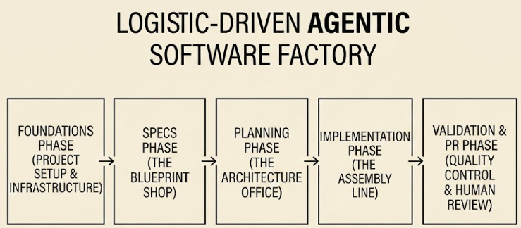

[🇬🇧](agentic-engineering-1.md) [🇪🇸](agentic-engineering-1-es.md)

## "Agile mató a la especificación porque programar (bien) era difícil. La IA está trayendo de vuelta la especificación porque ahora el código es barato, pero la dirección es cara."

> Mira ahora el [resultado de este post](https://c11r11.github.io/agentic-factory-showcase/){:target="_blank"}.

# Agentic engineering, parte uno.

**Captando la idea...**

Después de un par de videos en YouTube, decidí profundizar en esto. Hasta ahora, el "Vibe coding" y el "prompt engineering" eran dos cosas que compartían una salida no determinista. El concepto de Desarrollo Dirigido por Especificaciones (Spec-Driven Development - SDD) apareció para intentar acortar la brecha entre las soluciones basadas en LLM y algo productivo y confiable.

**El viejo y confiable Waterfall**

El SDD no es nuevo; es algo que empecé a hacer cuando por primera vez me contrataron para construir software a tiempo completo por allá por el 2010 👴🏼. Para producir una buena pieza de software, primero necesitas saber qué estás haciendo. Esa es la fase de análisis, donde las personas se enfocan en entender un problema y generan requerimientos (junto con los clientes). Con Agile, llegamos a un punto donde mucha documentación detallada no era tan relevante; eso fue en parte porque el desarrollo de software pasó de un contexto más científico o formal a la web, donde todos quieren crear un sitio o una app, y la mayoría de las veces el cliente necesita descubrir lo que quiere construir.

Agile se centró en hacer software funcional que hablara por sí mismo. Eso fue básicamente porque escribir código era algo difícil de hacer, y hacerlo mantenible era aún más complejo. Surgieron los patrones de diseño, junto con el clean code, SOLID y más. Esto se adaptó perfectamente a la industria: si el código es difícil de hacer bien, no pierdas tiempo haciendo especificaciones; descubramos todos juntos qué queremos construir y tratemos de hacerlo de la mejor manera posible.

**Hasta que...**

Esa fue la realidad durante un par de décadas, hasta que ChatGPT irrumpió y cambió la idea de hacer software. Actualmente, los agentes basados en LLM pueden realizar refactorizaciones completas y desarrollar productos completos. Ahora, con un ritmo de programación mucho más rápido, el problema vuelve a ser definir qué queremos: de vuelta a la especificación detallada.

Con eso, hacer buen software también se vuelve más fácil. En el pasado he hecho módulos con TDD (y en c++), pero eso toma mucho tiempo, y a veces se evitaban cambios de diseño. Ahora puedo decirle a un agente LLM que cree siempre todo tipo de suites de prueba.

**Hice algo con una definición ad-hoc de SDD**

Entonces, necesitaba una excusa para crear algo con SDD y ver qué pasaba. La idea era simular cómo puede operar una cadena de suministro de código (code supply chain). La siguiente imagen define la idea principal.

**Fases**

### Descripciones de Fases Propuestas

* **Foundations (Estableciendo el Harness):** Establecimiento del modelo de gobernanza del proyecto. Esto incluye definir los límites arquitectónicos en `GEMINI.md`, configurar las *skills* del agente y asegurar el *stack* tecnológico. El *harness* actúa como el "andamiaje determinista" necesario para asegurar la implementación y prevenir la divergencia del agente.
* **Specs (Definiendo el Contrato):** Una fase de análisis bidireccional donde se formaliza el "Qué". A través de un diálogo de ida y vuelta con la CLI del LLM, los requerimientos se transforman en especificaciones Markdown persistentes que sirven como la única fuente de verdad (*single source of truth*) para toda la cadena de suministro.
* **Planning (Descomposición Estratégica):** El agente LLM toma el "asiento del conductor" para deconstruir especificaciones complejas en un conjunto finito y accionable de tareas de implementación. Dado que la ejecución posterior es desatendida, esta fase requiere una validación humana formal (*sign-off*) para asegurar que el plan se alinea con la arquitectura prevista.
* **Implementation (Autonomía Restringida):** El agente LLM ejecuta el plan de forma autónoma. Consume las especificaciones, respeta las reglas del *harness* y genera la base de código. Esta fase concluye con la creación de una rama y un *Pull Request*, transicionando el trabajo desde la generación "sintética" de vuelta a la supervisión humana.
* **Validation (Gate de Calidad con Humano en el Ciclo):** Una fase crítica de revisión donde la salida autónoma es auditada por expertos humanos. La implementación se valida contra las especificaciones originales; una vez aprobado el PR, el código se fusiona en la rama productiva, completando el ciclo.

**Elección de la herramienta**

Para ver cómo funciona esto, elegí **Gemini CLI**. Primero, porque es el primero que encontré con un free tier. La idea del ejercicio es:

* Empezar de cero, pidiendo a Gemini CLI que cree el entorno (harness).
* Definir la especificación (spec), planear e implementar.
* Iterar.

Los resultados fueron bastante buenos para un primer intento y sin ningún framework o herramienta externa como openspec o similares.

* Gemini CLI (y todos los otros chats de LLM que encontré) me ayudaron.
* Me quedé sin cuota gratuita un par de veces.
* Creé especificaciones y varias "skills" para ayudar a crear las specs, planear y luego generar código.

**Telemetría de Tokens**

Junto con el código, creé una "skill" y reglas para tener telemetría de todos los prompts que envío, con la idea de crear un tablero (dashboard) y rastrear cuántos tokens de entrada, razonamiento y salida se necesitan a lo largo de todo el ciclo de SDD. Esto le da un toque más experimental a este ejercicio para ver más adelante qué fase de SDD o implementación de historia de usuario consume más razonamiento.

**Resultados**

Este es un dashboad resultante de la implementación de SDD.

[Ver el resultado](https://c11r11.github.io/agentic-factory-showcase/){:target="_blank"}

* Este dashboard proporciona una ventana transparente a la "Labor Sintética" de este ejercicio.
* El conteo de tokens es real; toda la información fue recopilada durante el proceso de creación del dashboard y del backend que lo procesa.
* Un slice es una pieza de software a construir; el equivalente a una historia de usuario (user story).
* La Eficiencia de Producción es el ratio de rendimiento entre el Consumo Total del Ciclo de Vida y los Tokens de Salida Funcional. Un porcentaje inicial bajo es normal: representa el "Impuesto Arquitectónico" necesario para estabilizar el Harness Agéntico. A medida que el contexto y las restricciones del proyecto (vía GEMINI.md) maduran, esta métrica sirve como indicador principal de la salud del harness. Si la eficiencia no escala con el tiempo, esto señala una falla sistémica en la alineación entre el prompt y el contexto.

### Conclusiones

* La transición de "escribir código" a "escribir especificaciones" es un cambio mental; cambia el golpe inmediato de dopamina de programar por la estabilidad a largo plazo de la arquitectura. Puedes empatizar con esos comentarios de "ya no es divertido".
* Se puede ver el SDD en acción y funcionando.
* La medición de tokens, aunque bastante rudimentaria, muestra que la primera parte del SDD (los cimientos) requiere mucho trabajo y tiempo para alinear al agente LLM para que no alucine y siga la idea.
* Me recuerda a tener que trabajar con programadores: personas especializadas en entender requerimientos y convertirlos en código. Si no defines bien la tarea, surgen problemas. Ahora es bueno y malo al mismo tiempo: el agente puede rehacer el trabajo y no quejarse, pero no hay nada como los humanos entendiendo el contexto del producto, el vocabulario y todas las cosas que los agentes no captan (aún).

### Próximos pasos

* Gemini CLI tiene un plan de pago por uso (pay-as-you-go) donde pagas por los tokens utilizados. Quizás aplicar principios de FinOps de infraestructura a este ejercicio puede ser una buena forma de ver puntos débiles y formas de ser más productivo.
* Otra buena idea puede ser encontrar formas de alinear el ritmo del usuario con este nuevo ritmo de programación. Actualmente, este tipo de tecnología produce más código del que los humanos (equipos de software y clientes) pueden procesar.

### Referencias

> Hay algunas más, pero estas son las más relevantes para el ejercicio.

- [Spec-Driven Development: From Code to Contract in the Age of AI Coding Assistants](https://arxiv.org/pdf/2602.00180){:target="_blank"}
- [Agent, Sub-Agent, Skill, or Tool? A Practitioner’s Guide to Extending Agentic AI Systems](https://www.techrxiv.org/doi/pdf/10.36227/techrxiv.177204917.78786098/v1?onload=true){:target="_blank"}
- [Agent Harness for Large Language Model Agents: A Survey](http://preprints.org/frontend/manuscript/1cceb6ffec11d44f73a135899b974632/download_pub)
- [Cómo mis agentes escribieron 200k líneas de código en producción - T3chFest 2026](https://www.youtube.com/watch?v=SUG-cEMFKFM){:target="_blank"} - [Presentación](https://docs.google.com/presentation/d/1nMuN1xpDj5DUCTqOcewRSQuux6tEbnGs0h2B6m-K0co/edit?slide=id.p14#slide=id.p14){:target="_blank"}

