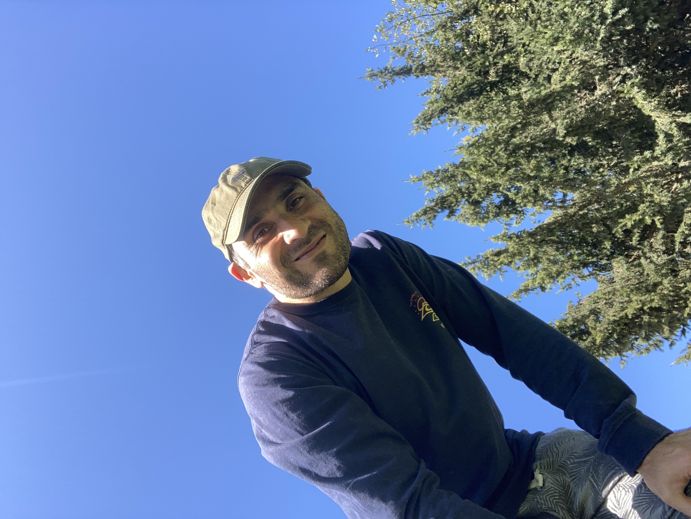

    

        

            
        

        

            
Hola, I'm <strong>Cristian</strong> from 🇨🇱

            Civil Computer Engineer with over 15 years of robust software engineering background (C++, .NET, PHP) who has spent recent years pivoting towards Application Security (AppSec), DevSecOps, and Quality Automation. Leverages a deep, structural understanding of legacy and cloud architectures to systematically identify vulnerabilities, design resilient automated testing pipelines, and bridge the gap between development squads and security frameworks. 

            
Fluent in English (B2) with extensive experience collaborating within international distributed teams under Agile/Scrum methodologies.

        

    

# Recent posts
*   **[Agentic Engineering, part 1](articles/agentic-engineering-1.md)** (may, 2026).

